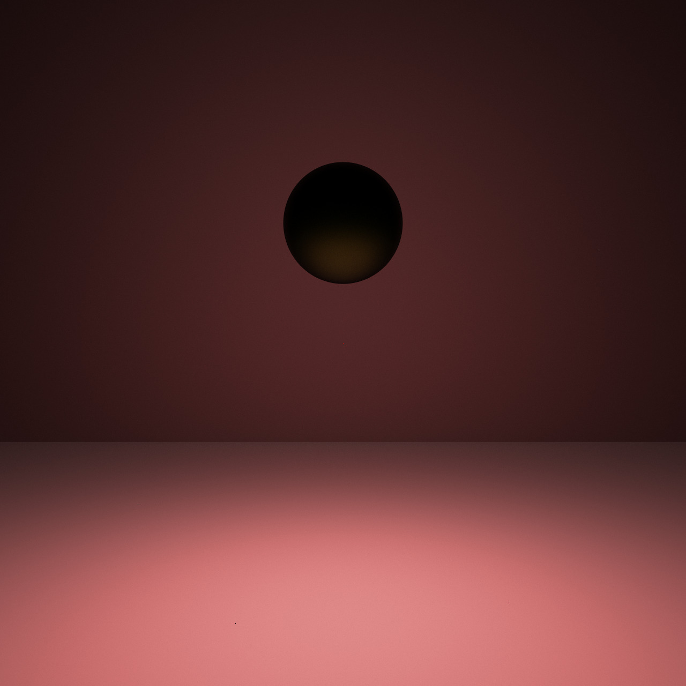
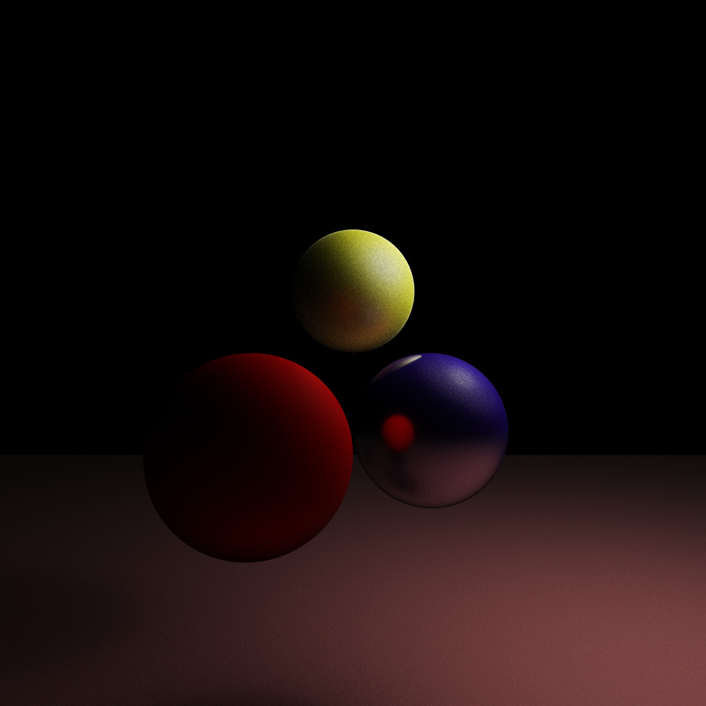
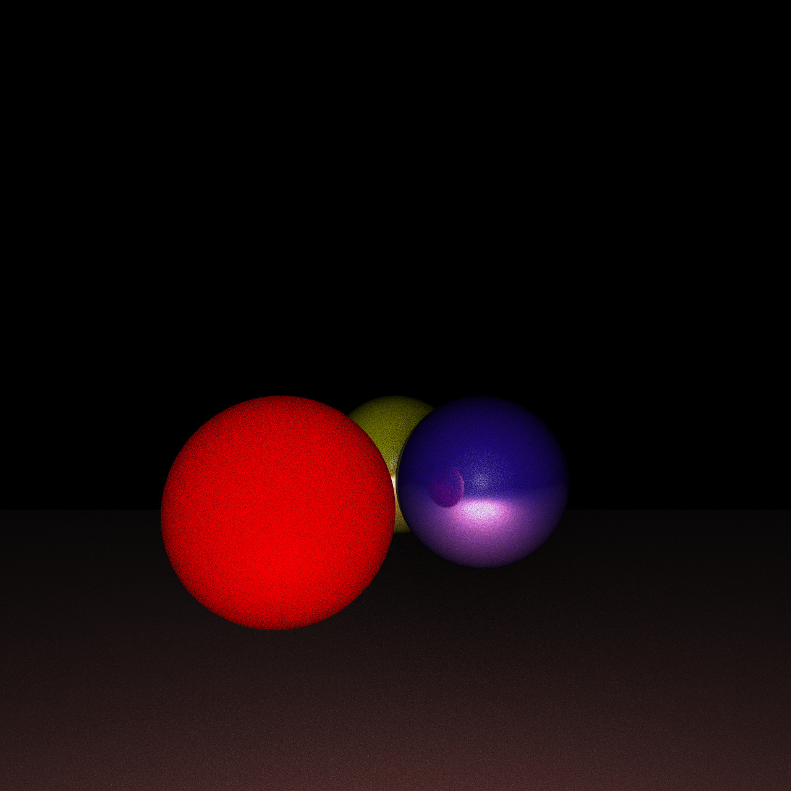
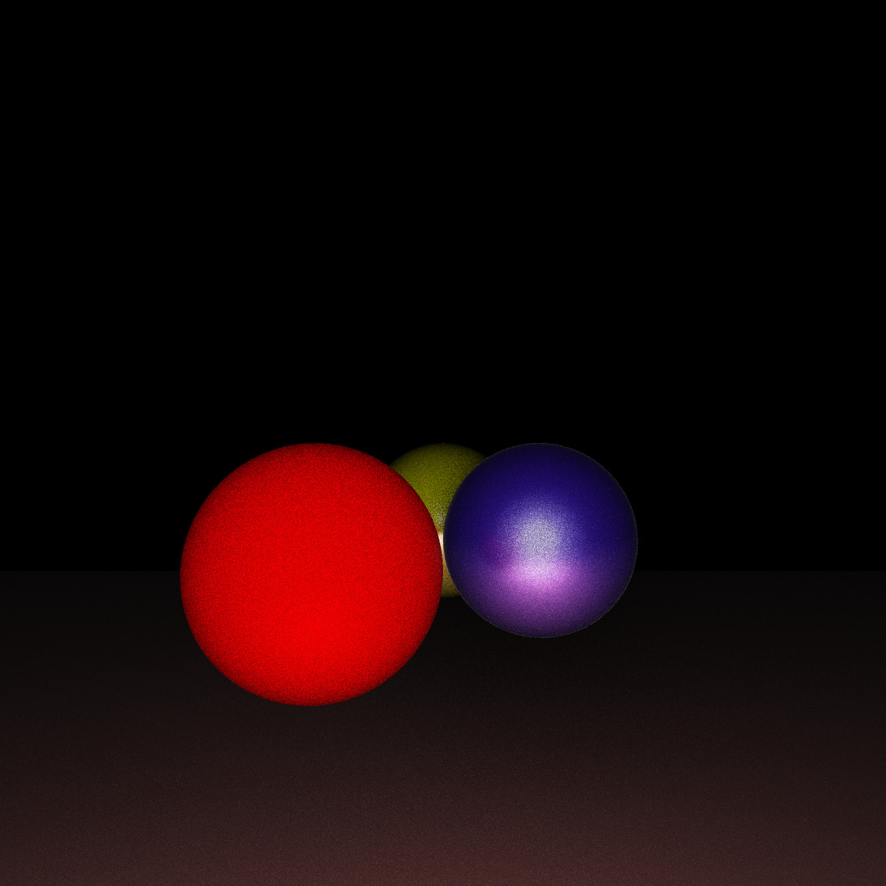
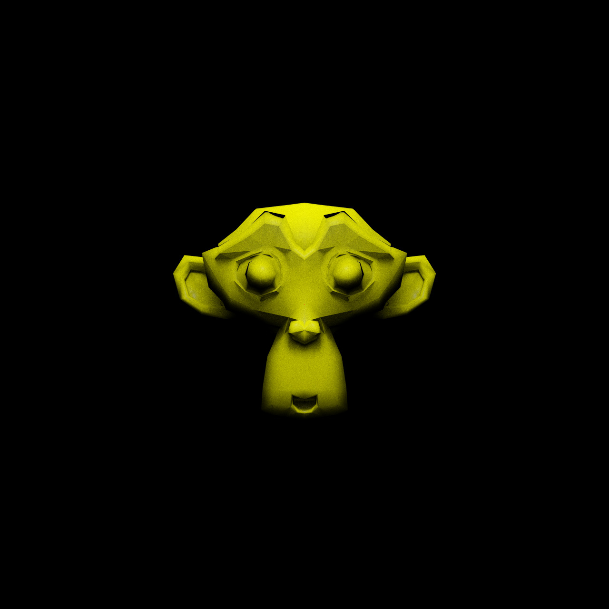
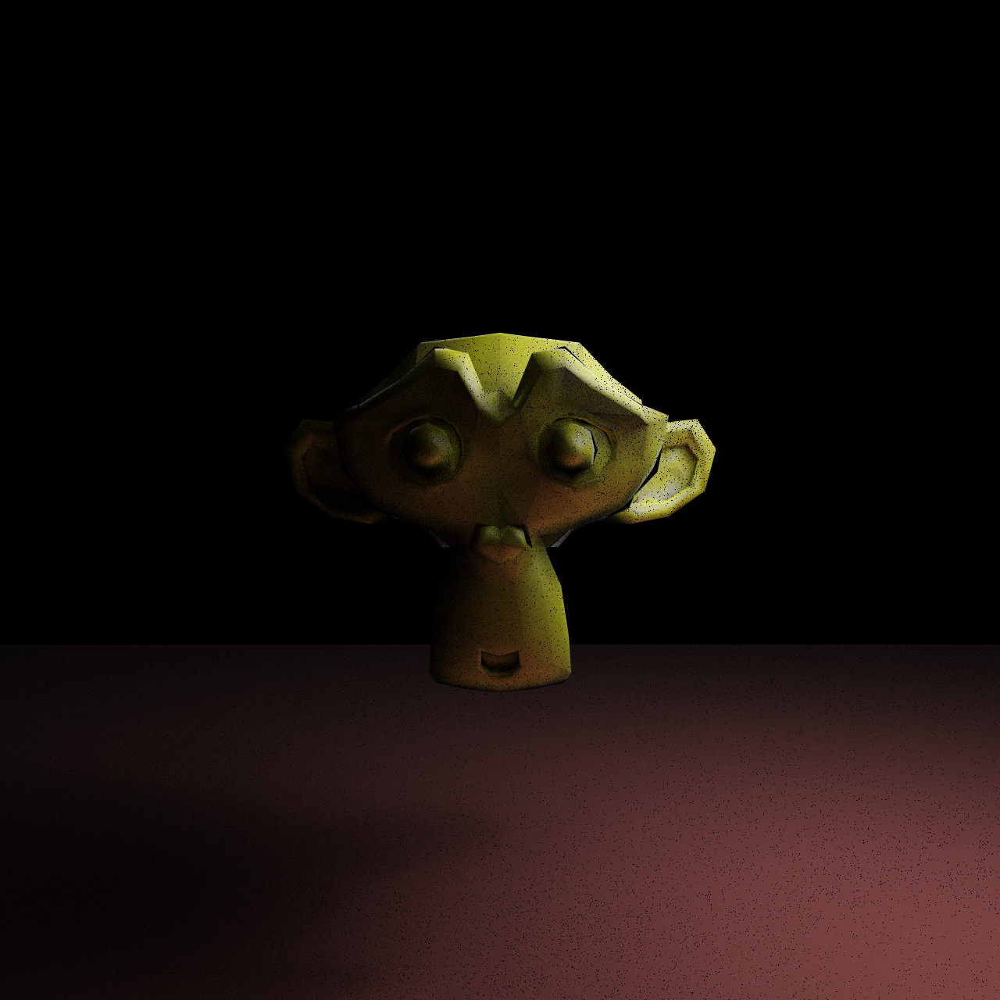

# Path Tracer 

I'm working on a multithreaded path tracer in Rust. It currently is in an early stage right now and needs a lot of polish. 

## Credits 

This project would not have been possible without the incredible introduction to 3D Rendering and Monte Carlo techniques on ScratchAPixel and the sound guidance of PBRT - Physically Based Rendering Techniques.

Credits to Disney for the materials.

## Features implemented
1. Unidirectional path tracing with russian roulette termination 
2. Basic import of OBJ meshes (material imports not supported)
3. Partial implementation of Disney materials from the paper "Physically based shading at Disney" (I haven't implemented the metallic or clearcoat lobes)
4. Spheres, Planes, Triangles and Triangle meshes are the primitives implemented
5. Phong interpolation for smoother display of meshes
6. 3D Transformation pipeline (All the routine transformations to/from Camera, NDC, World, Object, Raster - Perspective Projection) spaces, Translation, Rotation, Scaling
7. Point lights and Spherical area lights
8. Perfect diffuse and perfect specular materials 
9. Multithreaded - Splits up the image into chunks and renders each chunk
## How it works 

One liner: We bounce rays around randomly in order to approximate the rendering equation. This is called Monte Carlo integration.

<insert equation>
The rendering equation is based around conservation of energy and governs how light is distributed around the scene. 

f_r is the BRDF (Bidirectional Reflectance Function) that tells how much of the light from direction w_i is reflected to direction w_j. Note that it isn't just about the quantity of light, it is about the spectrum of light. So we can receive white light and reflect red light (so the material will appear red).

We approximate it by shooting rays randomly from the point of intersection, accumulating radiance. 

Overall flow: We start on the image grid and draw a ray from each pixel of the grid to the camera. We then check where this ray goes and which objects it intersects. At the point of intersection of the first object, we start doing the following two steps:
1. Create a ray from object to light source and calculate radiance 
2. Shoot a ray in a direction governed by the object's BRDF (usually randomized) and calculate the amount of light reaching the eye from that ray
   
Note that this is a recursive process - To know how much light is coming in step 2, we recurse into the object and try to calculate the radiance at tha tpoint.

## Sample Renders
#### 1280 x 1280, 1024 samples

#### 1280 x 1280, 16 samples

#### 1280 x 1280, 64 samples

#### 1280 x 1280, 128 samples

#### 1280 x 1280, Lower Roughness, 16 samples

#### 1280 x 1280, Higher Roughness, 16 samples

#### 1280 x 1280, Suzanne Mesh, 64 samples

#### 1280 x 1280, Suzanne Mesh, 128 samples (Notice the black dots - these are due to NANs appearing [needs to be fixed])

## Things to think about
1. Noise Reduction - There's a lot of noise in the rendered images. This can be reduced by doing better sampling (stratified sampling?) for the image pixels, cosine weighted sampling and implementing multiple importance sampling 
2. Making it faster - One of the main reasons for slowness is because we're checking all the primitives for intersection. This is horribly inefficient and I need to implement either BVH or KD-Trees to have any hope of rendering larger meshes in a reasonable amount of time 
3. Precision issues - The intersection tests are written in a naive way - So there'll be floating point gotchas all over the place. They need to be refactored into versions that minimize floating point error 
4. Following Rust conventions - I'm probably missing out on this big time - since this is my first time writing a project in Rust. If you're reading this, please consider opening issues on making this more Rusty
5. Better way of specifying scenes (from a file for instance) - Currently there is pollution of code due to descriptions of scenes being in main.rs. This should be refactored out and we need a cleaner way for describing scenes
6. Sampling from multiple lights - Right now, I'm just shooting a light ray to one light source. Of course, it would be better if we can have multiple light sources.
7. Progress Bar - The progress bar updates too infrequently and updates erratically. Need to investigate.
8. Remap Disney Materials correctly - Though the Disney materials BRDF implementation works, I suspect that it isn't up to spec - Need to check whether I'm mapping all of the values correctly
   

## Possible future additions 
1. Constructive Solid Geometry 
2. Textures

